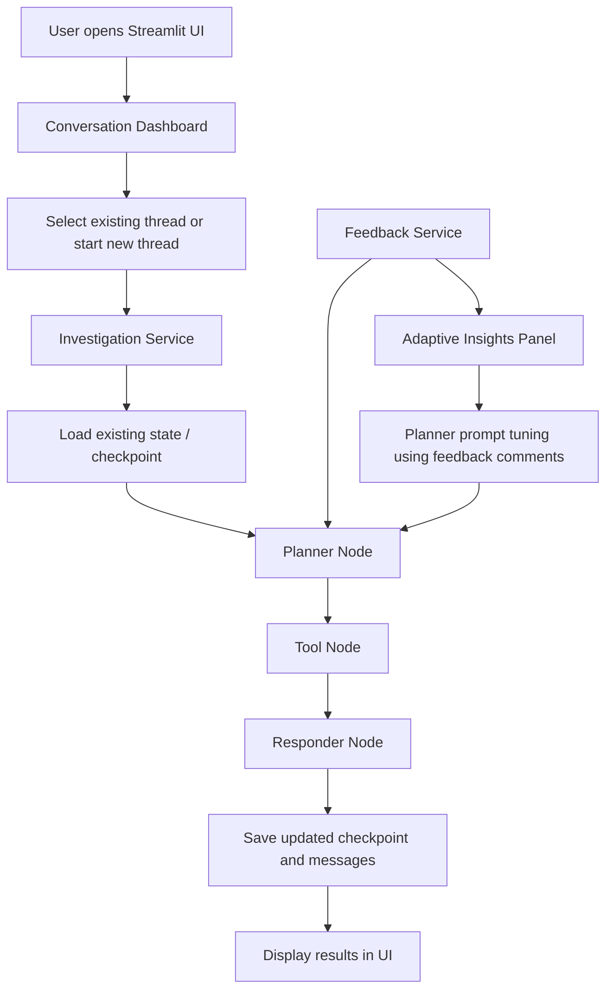

# Architecture Flow for BankOps AI

## Purpose
This document describes the end-to-end flow of the BankOps AI investigation assistant and the main extension points for future changes.

## High-Level Architecture

## Request Lifecycle
1. The user enters a customer ID and investigation request in the Streamlit UI.
2. The UI routes the request to the investigation service.
3. The investigation service reloads the existing thread state if a prior checkpoint exists.
4. The planner creates an execution plan based on the customer issue and available tools.
5. The tool node executes policy, customer, or transaction actions as needed.
6. The responder generates the final recommendation and explanation.
7. The updated state, messages, and plan are persisted as a checkpoint for future resume.

## Persistence and Resume Flow
- Each thread is stored in a checkpoint file under the data/checkpoints folder.
- On resume, the app restores the previous request, message history, plan, tool outputs, and response.
- The user can continue the conversation from the previously saved point without starting over.

## Feedback and Adaptive Behavior
- Positive and negative feedback are stored in the feedback service.
- User comments are captured alongside the rating.
- Recent comments are used to adjust the planner prompt and improve future response quality.
- The UI exposes adaptive insights such as positive/negative counts and recent feedback comments.

## Recommended Extension Points
- Add new tools by registering them in the tool layer and exposing them to the planner.
- Extend persistence by adding richer metadata such as case status, priority, or owner.
- Add new dashboard metrics such as active cases, completed cases, or average resolution time.
- Introduce new evaluation criteria for safety, clarity, and tool correctness.
